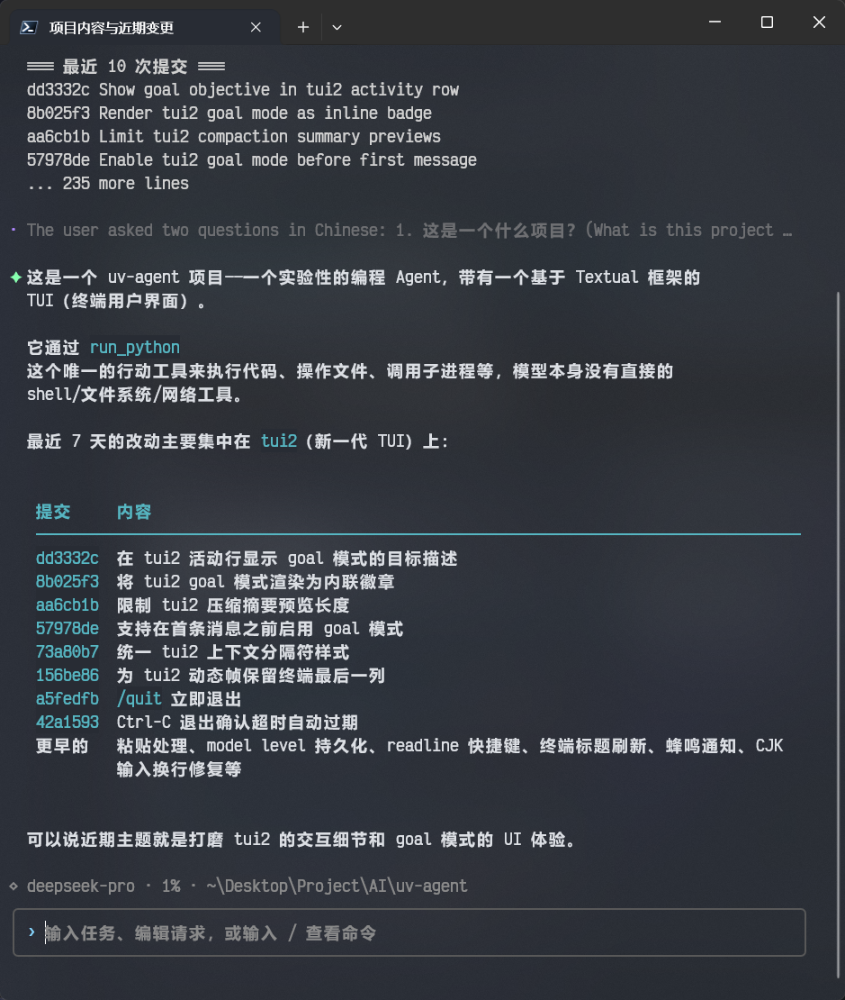

# uv-agent



[简体中文](README.zh-CN.md)

**Python-native coding agent — one `run_python` boundary. Every external action is
auditable, replayable, and interruptible.**

`uv-agent` channels all model capabilities through a single, well-defined exit: the
model can only touch the outside world via `run_python`. Each call is a complete
Python script executed in a `uv run`-managed isolated environment, using
`uv_agent_runtime` helpers for file editing, command execution, code search,
images, and plugin-provided capabilities such as MCP clients and workflow graphs.
With only one exit, you can replay any run and see
exactly what happened and why.

The project is still experimental. Public APIs, config fields, and runtime behavior
may change.

## Features

- **Single tool boundary** — no shell, filesystem, browser, or MCP model tools. The
  model writes Python; the managed runtime executes it. Every external action is an
  auditable script.
- **Cache-aware NetGain compaction** — long conversations no longer trigger blind
  compression. A pre-turn lightweight judge round lets the model estimate remaining
  calls and history dependency, then computes the net gain of compaction via an
  economic formula. Compression fires only when cache savings outweigh information
  loss. Recent context is retained verbatim (K tokens) to avoid losing key details.
- **Python managed runtime** — scripts run in a project-shared `uv` environment.
  `uv_agent_runtime` provides helpers for read/write/edit, FFF-backed search,
  subprocesses, dependency installation, images, and plugin-provided namespaces.
  Scripts serve as documentation — no opaque shell commands.
- **Plugin system** — trusted Python packages discovered via `uv_agent.plugins`
  can add runtime namespaces (`rt.mcp`, `rt.workflow`, custom helpers), actions,
  slash commands, UI providers, model context, event subscriptions, durable
  storage, and programmatic turn submission while preserving the single
  `run_python` model boundary.
- **Headless service mode** — `uv-agent daemon` starts the host and plugins
  without opening the TUI, so schedulers, chat bridges, webhooks, and other
  long-running integrations can keep working for a project state.
- **Self-bootstrapping** — uv-agent is developed using uv-agent. Reading, editing,
  testing, and iterating on the project are done with uv-agent itself.
- **Progressive context disclosure** — skills, MCP servers, and workspace rules are
  not dumped into the prompt all at once. The model receives an index first; full
  content is disclosed only when needed. Removed capabilities are explicitly marked
  to prevent stale-context errors.
- **Goal mode durable memory** — `/goal` creates a per-thread checklist/notes layer
  independent of the chat transcript. After compaction or resume, the model consults
  goal plugin state rather than relying solely on summarized history.
- **Prompt-cache-friendly design** — the system prompt prefix is guaranteed
  byte-identical within an epoch. Compaction requests share the same prefix structure
  as normal calls, maximizing provider-side cache hits. Cache reads are nearly free.

## Cache-Aware Compaction

The cache-aware compaction introduced in v0.16.0 is uv-agent's core optimization for
long-running sessions. Unlike traditional "compress when context hits N%," uv-agent
makes an economic decision before every turn:

1. The model estimates how many more conversation rounds are needed
   (`remaining_calls_bucket`) and how strongly the task depends on history
   (`history_dependency`).
2. It enumerates K retention candidates and evaluates the NetGain for each: future
   cache savings minus compaction call cost, cache invalidation loss, information
   distortion penalty, plus context quality improvement gain.
3. Compaction fires only when the best net gain exceeds a margin-scaled threshold;
   otherwise it skips, avoiding wasted compression for short tasks.

Compaction requests share the exact same prefix structure as normal calls (system
prompt → tools → messages), ensuring provider-side prompt prefix caches stay warm.
Over 90% of input tokens in a typical compaction call are billed at cached rates
(typically 1%–10% of the normal input price).

This design draws on the DP compaction algorithm from
[bash-agent](https://github.com/lloydzhou/bash-agent), with thanks.

## Quick Start

Prerequisites:

- **uv** — https://docs.astral.sh/uv/getting-started/installation/
- **Git** — needed for normal coding workflows and Worktree mode.

```powershell
# Run the latest published release
uvx uv-agent@latest

# Run from a local checkout
uv run uv-agent

# Single-turn question (no TUI)
uvx uv-agent@latest ask "Summarize the project structure"

# Resume an existing thread
uvx uv-agent@latest ask --thread thr_xxx "Continue where we left off"

# Run the headless service host for plugins and schedulers
uvx uv-agent@latest daemon --replace
```

## Model Configuration

uv-agent ships with no real provider configuration. Configure at least one provider,
model, and level in `~/.uv-agent/config.json` (or project-level
`.uv-agent/config.json`). Keep API keys in environment variables or git-ignored
local config.

Supported API formats:

| `api` value | Format |
| --- | --- |
| `"responses"` | OpenAI Responses API |
| `"chat_completions"` | OpenAI Chat Completions API |
| `"anthropic_messages"` | Anthropic Messages API |

<details>
<summary>Full configuration example</summary>

```json
{
  "providers": {
    "deepseek": {
      "base_url": "https://api.deepseek.com",
      "api_key": "sk-xxxxxxxxxxxxxxxxxxxxxxxxxxxxxxxx",
      "timeout_s": 7200,
      "chat_completions": {
        "path": "/chat/completions"
      },
      "message_passthrough": {
        "assistant": [
          "reasoning_content"
        ]
      },
      "reasoning_display": {
        "assistant_message_fields": [
          "reasoning_content"
        ],
        "stream_delta_fields": [
          "reasoning_content"
        ]
      }
    },
    "minimax": {
      "base_url": "https://api.minimaxi.com",
      "api_key": "sk-xxxxxxxxxxxxxxxxxxxxxxxxxxxxxxxxxxxxxxxxxxxxxxxxxxxxxxxxxxxxxxxxxxxxxxxxxxxxxxxxxxxxxxxxxxxxxxxxxxxxxxxxxxxxxxxxxxxxxxxxxxxxx",
      "timeout_s": 7200,
      "chat_completions": {
        "path": "/v1/chat/completions"
      },
      "anthropic_messages": {
        "path": "/anthropic/v1/messages"
      }
    }
  },
  "models": {
    "deepseek-v4-flash": {
      "provider": "deepseek",
      "model": "deepseek-v4-flash",
      "api": "chat_completions",
      "supports_images": false,
      "context_window_tokens": 1000000,
      "params": {
        "reasoning_effort": "high"
      }
    },
    "deepseek-v4-pro": {
      "provider": "deepseek",
      "model": "deepseek-v4-pro",
      "api": "chat_completions",
      "supports_images": false,
      "context_window_tokens": 1000000,
      "params": {
        "reasoning_effort": "max"
      }
    },
    "MiniMax-M2.7": {
      "provider": "minimax",
      "model": "MiniMax-M2.7-highspeed",
      "api": "anthropic_messages",
      "supports_images": false,
      "context_window_tokens": 204800
    }
  },
  "levels": {
    "deepseek-flash": {
      "model": "deepseek-v4-flash"
    },
    "deepseek-pro": {
      "model": "deepseek-v4-pro"
    },
    "MiniMax-M2.7": {
      "model": "MiniMax-M2.7"
    }
  },
  "runtime": {
    "default_level": "deepseek-flash",
    "store_provider_response": false,
    "max_agent_rounds": 1000,
    "compression": {
      "enabled": true,
      "model_level": "deepseek-flash",
      "trigger_ratio": 0.9
    },
    "title_generation": {
      "enabled": true,
      "model_level": "deepseek-flash"
    },
    "branch_name_generation": {
      "enabled": true,
      "model_level": "deepseek-flash",
      "timeout_s": 15.0
    }
  },
  "runner": {
    "default_timeout_s": 7200,
    "max_output_bytes": 1000000,
    "max_run_logs": 200,
    "scriptenv_index_url": null
  },
  "logging": {
    "level": "INFO",
    "file_enabled": true,
    "console_enabled": false,
    "max_bytes": 5000000,
    "backup_count": 3
  },
  "pricing": {
    "currency": "RMB",
    "unit": "1M_tokens",
    "models": {
      "deepseek-v4-flash": {
        "input": 1,
        "output": 2,
        "cached_input": 0.02
      },
      "deepseek-v4-pro": {
        "input": 3,
        "output": 6,
        "cached_input": 0.025
      }
    }
  },
  "ui": {
    "completion_notification": {
      "enabled": true
    }
  },
  "plugins": {
    "my-plugin": {
      "enabled": false
    },
    "another-plugin": {
      "enabled": true,
      "config": {
        "option": "value"
      }
    }
  }
}

```

</details>

Use `/config` in the TUI to switch default level, language, and compression
settings. See [configuration](docs/configuration.md) for every option and
[config.example.json](docs/config.example.json) for a standalone example.

## Logging

uv-agent writes operational logs to the project state log directory, usually
`~/.uv-agent/projects/<project-id>/log/uv-agent.log`. Per-plugin logs live under
`~/.uv-agent/plugins/<plugin-id>/logs/plugin.log`. Both use the top-level
`logging.max_bytes` and `logging.backup_count` rotation settings; defaults keep
about 5 MB per active log and 3 backups. `--log-level` overrides
`logging.level` for the current process.

## Everyday Workflow

- Type and press `Enter` to send. Use `Ctrl+Enter` / `Ctrl+J` for newlines.
- Type `/` from an empty composer to open the command palette; type to filter.
  `@` for file mentions, `@@` for thread mentions.
- `/level <name>` to switch models; `/status` to inspect runtime state including
  cache compaction judge details.
- `/goal enable [objective]` for durable task checklists across long sessions.
See [TUI and slash commands](docs/tui.md) for the full list.

## TUI Interfaces

- **tui** (default, `uv-agent` or `uv-agent tui`) — lightweight ANSI TUI rendered
  directly in the terminal. Compact status rows, streaming events, Goal/Worktree
  mode, and image attachments.

## Service Mode

`uv-agent daemon` runs the same host/plugin stack without launching the terminal
UI. Use it when plugin capabilities need a long-lived process: scheduled actions,
external chat or webhook bridges, programmatic turn submission, or background
event relays.

The daemon acquires a project-state lease and heartbeat so one active host owns
integrations for that workspace. Use `--replace` to stop a stale or older daemon
for the same state.

By default, daemon mode uses `~/.uv-agent/workspace` as its persistent workspace
and creates an `AGENTS.md` there when one does not already exist. Use
`--workspace <path>` to choose a different daemon workspace.

```powershell
uv-agent daemon --replace
```

## Plugins

Plugins are trusted Python packages discovered via the `uv_agent.plugins` entry
point and loaded into the uv-agent host process. They extend the host without
changing the model boundary: the model still acts through `run_python`, while
plugin capabilities appear as script helpers, commands, actions, UI additions,
and structured model context.

Plugins can:

- expose runtime helper namespaces such as `rt.mcp`, `rt.workflow`, or
  project-specific `rt.<name>` helpers;
- register actions for schedulers and other automation;
- add slash commands, picker/UI providers, and localized text;
- subscribe to host events, keep private storage, and submit turns from external
  systems.

Built-in Goal, Worktree, Skills, MCP, Workflow, and Scheduler capabilities use
this same plugin surface. Install only plugins you trust.

```powershell
uvx --with your-uv-agent-plugin uv-agent@latest
```

See [Plugin system](docs/plugins.md) for details.

## Runtime & Context

Every model turn = stable system prompt + on-demand structured context.

- `run_python` is the only external action surface. Scripts execute in a
  project-shared uv environment and import `uv_agent_runtime` helpers. The uv
  environment and working directory are separate; the cwd can change via
  `enter_dir` or Worktree mode.
- Runtime context (helper lists, skills, MCP servers, etc.) is plugin-owned epoch
  context. Plugins publish full epoch context after refresh/compaction and may
  enqueue explicit XML updates when their own state changes.
- Workspace rules are disclosed progressively: index first, full AGENTS.md only
  when entering the relevant directory.
- Goal mode provides a durable checklist/notes layer independent of the chat
  transcript, preserving task progress across compaction and resume.
- Checkpoint compaction summarizes the conversation while excluding reloadable
  runtime context. New epochs replay structured context before retained history.

## Documentation

- [Configuration](docs/configuration.md)
- [Full config example](docs/config.example.json)
- [TUI and slash commands](docs/tui.md)
- [Runtime and managed scripts](docs/runtime.md)
- [Plugin system](docs/plugins.md)

## Development

uv-agent is self-bootstrapping — it is developed using uv-agent itself for reading,
editing, testing, and iterating.

```powershell
uv run pytest
```

Local debug state, screenshots, config, and run data belong in `.uv-agent/` and
should stay out of git.

## Acknowledgments

The cache-aware compaction design draws on the DP compaction algorithm and cache
alignment approach from [bash-agent](https://github.com/lloydzhou/bash-agent),
with thanks.

## License

MIT. See [LICENSE](LICENSE).
